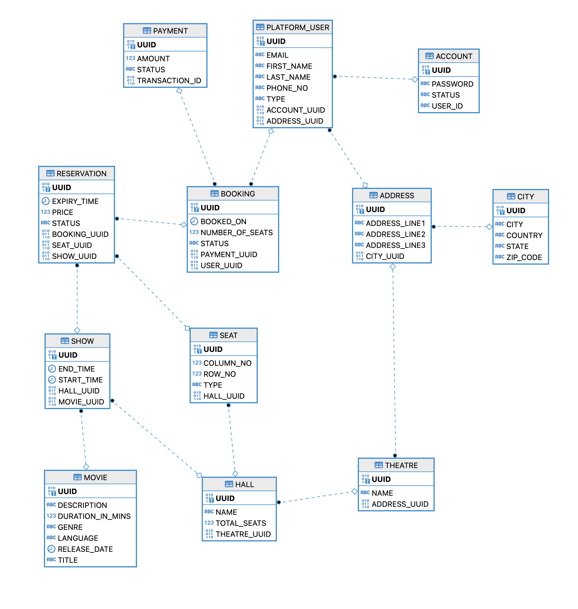
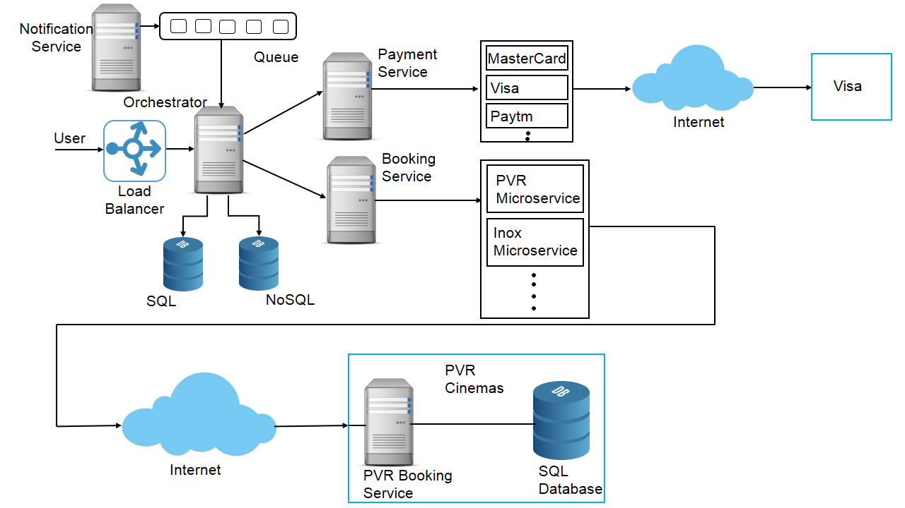

# Movie Ticket Booking System

This is a Demo Project which shows how a Movie Ticket Booking Platform can be created. 

## Code Implementation
Code implements following functionalities :
1. Search returns Theaters/Shows for selected city, movie and date.
2. Booking ticket for Selected Show and Seats for given User.

**Search Usercase:**

Current search functionality is implemented without using any caching mechanism, however in practise some kind of caching mechanism (like Redis, etc) would be used to serve static information much faster. 

**Booking Usecase:**

Booking functionality is designed keeping in mind the concurrency requirement and that application would be deployed in highly available environment with multiple instances of services running and serving requests simultaneously.
Once User1 selects show and seats, those seats are reserved for the user1 for 5 mins(this could be configured), During this time any other user could not book those seats. If user1 successfully completes the payment transaction with expiry time then seats are Booked and no longer available for other users.
However if payment transaction is not successful within expiry time then other users could reserve the seats. 

Currently payment confirmation is configured using a separate endpoint, but in practise this would depend on the callback mechanism provided by the payment gateways. 

## Project Structure and Sample Data
Project follows standard java packaging structure and is created using Spring Boot and maven.
1. `resource` folder contains `ddl.sql` which contains SQL queries for creating entire database structure and indices.
2. `data.sql` contains sample data for creating `movie`, `hall`, `show`, `user`, `account`, `seat`, `city`, `address`, etc.
3. API's are created using uuids of entities instead of values, assumption is that there would be separate get API's to fetch entities individually.
4. Database Entity relationship are described in following diagram. 

5. Attached is a diagram showing high level architecture of how these services would be deployed in scalable environment using docker, kubernetes and cloud platforms.  


## Running the Project
Project could be run using following command inside project parent directory:
```shell
mvn spring-boot:run
```

## API Contracts
Following section provides the API's Contracts with sample request and response.

### Search 
Search returns List of Theatres with Halls and Shows.

Request :
```shell
curl --location --request GET 'http://localhost:8080/search?movieUuid=752d9145-4e88-43b9-8486-72a9d6a017db&cityUuid=53c9d62f-5c33-452a-b1fc-cfd94328bfa9&date=2023-01-10T09:00:00Z'
```

Response :
```json
[
    {
        "uuid": "d2210fc8-d679-4915-8566-a36b8b707543",
        "name": "city1 Theatre0",
        "halls": [
            {
                "uuid": "ecaf81bf-1057-438c-a2e7-f81958778025",
                "name": "Hall 0",
                "shows": [
                    {
                        "uuid": "bdd98157-f965-4682-9ab0-4a152543843f",
                        "startTime": "2023-01-10T19:00:00+05:30",
                        "endTime": "2023-01-10T21:00:00+05:30"
                    },
                    {
                        "uuid": "7e3cd65b-c4f5-4db2-a85b-9a72449d899c",
                        "startTime": "2023-01-10T16:00:00+05:30",
                        "endTime": "2023-01-10T18:00:00+05:30"
                    },
                    {
                        "uuid": "4a5a9579-6144-48c0-ad17-12a71e4c9b0c",
                        "startTime": "2023-01-10T13:00:00+05:30",
                        "endTime": "2023-01-10T15:00:00+05:30"
                    }
                ]
            }
        ]
    },
    {
        "uuid": "5b9457fd-38dd-4faf-b47a-095dcb6c93d7",
        "name": "city1 Theatre1",
        "halls": [
            {
                "uuid": "f3c15877-72dd-40eb-bc1c-cbc8c281d88f",
                "name": "Hall 0",
                "shows": [
                    {
                        "uuid": "ef612f1f-b2d8-40c3-945d-3545a07390c1",
                        "startTime": "2023-01-10T19:00:00+05:30",
                        "endTime": "2023-01-10T21:00:00+05:30"
                    },
                    {
                        "uuid": "800ac180-6844-499b-8dd4-9e79078af35a",
                        "startTime": "2023-01-10T13:00:00+05:30",
                        "endTime": "2023-01-10T15:00:00+05:30"
                    },
                    {
                        "uuid": "9ca9c89d-44fa-4447-9d23-b7bcd819b6bf",
                        "startTime": "2023-01-10T16:00:00+05:30",
                        "endTime": "2023-01-10T18:00:00+05:30"
                    }
                ]
            }
        ]
    },
    {
        "uuid": "5001e059-fd0c-4998-8b94-108e20db52e8",
        "name": "city1 Theatre2",
        "halls": [
            {
                "uuid": "b95a8690-4b99-441e-930f-ea62a61f4db7",
                "name": "Hall 0",
                "shows": [
                    {
                        "uuid": "e405525d-d4b8-4913-a831-b02fb3126d2d",
                        "startTime": "2023-01-10T13:00:00+05:30",
                        "endTime": "2023-01-10T15:00:00+05:30"
                    },
                    {
                        "uuid": "e3690a84-9d45-4339-83fe-7fa00b64ca03",
                        "startTime": "2023-01-10T19:00:00+05:30",
                        "endTime": "2023-01-10T21:00:00+05:30"
                    },
                    {
                        "uuid": "0fe842ad-2f00-46d4-985a-26b4cb434d34",
                        "startTime": "2023-01-10T16:00:00+05:30",
                        "endTime": "2023-01-10T18:00:00+05:30"
                    }
                ]
            }
        ]
    }
]
```

### Booking
Create Booking for selected show and seats for a given user

Request :
```shell
curl --location --request POST 'http://localhost:8080/book' \
--header 'Content-Type: application/json' \
--data-raw '{
    "userUuid":"9fa8c8ac-5aec-493d-a0af-ede7f4c9800d",
    "showUuid":"4a5a9579-6144-48c0-ad17-12a71e4c9b0c",
    "seatUuids" : [
        "a07f08ec-c221-40e5-adb7-8acbfa9b2249",
        "cce2e267-6aac-4eef-99f6-30551404f2df",
        "f87a0251-fd5e-4af4-aa3d-a735826d61db"
    ]
}'
```

Response :
```json
{
    "uuid": "bd4a3cbc-443f-4ace-99e3-b2b05288bba3",
    "status": "PENDING",
    "bookedOn": "2023-01-10T18:46:27.753929+05:30",
    "noOfSeats": 3
}
```

### Booking Confirmation when Payment is successful

Request:
```shell
curl --location --request PUT 'http://localhost:8080/book/5a9efcfe-c343-4309-91b0-c7793d77586e'
```

Response:
```json
{
    "uuid": "5a9efcfe-c343-4309-91b0-c7793d77586e",
    "status": "CONFIRMED",
    "bookedOn": "2023-01-10T16:55:36.528763+05:30",
    "noOfSeats": 3
}
```